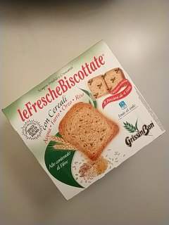
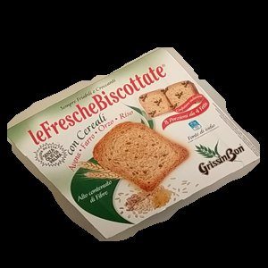
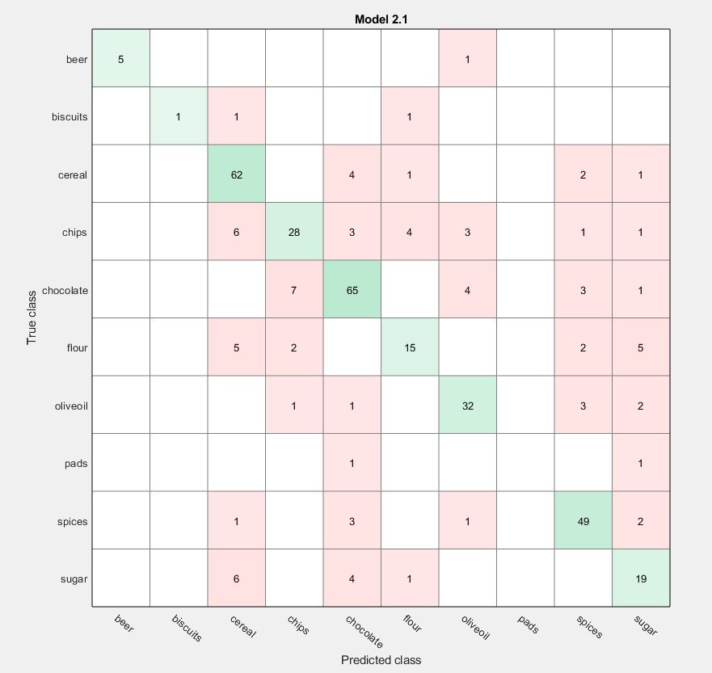

# Presentazione
Federico Lodovici 816040
Luca Di Gennaro 820612

## Intro

### Scope del progetto

Il progetto consiste nel riconoscimento di 10 differenti classi di oggetti,
i quali possono essere posti su superfici qualsiasi, sia uniformi che
texturizzate.
Le immagini possono contenere svariati oggetti che devono però appartenere
alla stessa classe.
Le classi di oggetti che abbiamo deciso di riconoscere sono:
* Assorbenti
* Birra
* Biscotti
* Cereali
* Cioccolato
* Farina
* Olio d'oliva
* Patatine
* Spezie
* Zucchero

### Pipeline

### Vantaggi

1. Permette di eliminare la problematica dello sfondo
2. La CNN permette un' estrazione di feautures più robuste e consistenti
    rispetto agli altri metodi [1][1]

[1]: https://arxiv.org/abs/1403.6382

### Svantaggi e difficoltà

1. Abbiamo varie somiglianze tra alcune classi, per cui è possibile che alcuni
    oggetti vengano classificati in modo erroneo.
2. Sono richieste molte immagini nel dataset di training.
3. L'operazione di training è molto dispendiosa a livello computazionale.

## Come funziona

### Raccolta Dataset

Abbiamo raccolto immagini con 3 diverse modalità:

1. Abbiamo utilizzato una piccola webapp che ci ha permesso di raccogliere
    immagini fotografando i prodotti in diversi contesti.
2. Abbiamo utilizzato parte del dataset grocery market dell' università di
    friburgo.
3. Abbiamo utilizzato qualche immagine di sample dal web per arricchire
    ulteriormente il dataset.

### Preprocessing

  La fase di preprocessing permette di segmentare ragionevolmente l'area degli
  oggetti presenti nell'immagine, in modo da ridurre il più possibile le
  informazioni spurie dello sfondo e facilitare l'estrazione di
  feature rilevanti da parte della CNN.

  La fase di preprocessing è divisa in diverse sottofasi:
  1. Scaling dell'immagine
  2. Smoothing gaussiano
  3. Calcolo degli edge sui 3 canali RGB
  4. Unione dei 3 edge calcolati
  5. Dilatazione/chiusura degli edge e fill dei buchi
  6. Apertura degli edge per rimuovere eventuali bordi spuri

### Estrazione features (CNN)

L' Estrazione di features avviene utilizzando una Convolutional Neural Network.

Abbiamo utilizzato due differenti modelli di rete  con la tecnica del
*transfer learning*:
* AlexNet
* Googlenet

Per entrambe le reti sono stati eliminati gli ultimi layer della rete
pre-addestrata e sostituiti con dei nuovi layer in modo tale da ridurre
l' output da 1000 a 10 classi, per meglio adattarsi al nostro dataset.

Una volta riaddestrata la rete a cui sono stati aggiunti i nuovi layer le
features vengono estratte dall' ultimo layer prima dei livelli di classificazione.

### Classificazione

Si è utilizzato un classificatore del tipo X.

A X vengono dati in input le features estratte dall' immagine con la CNN.

Funzionamento X.

### Sample

| Input                       | Preprocessing                       | Output                       |
|-----------------------------|-------------------------------------|------------------------------|
|  |  |  |

## Prestazioni e comparison

### Scelte preprocessing

### Prestazioni  vari modelli di rete

#### Googlenet vs Alexnet

E' stata monitorata in particolare la funzione di loss durante il training delle reti.

###### Alexnet:

###### Googlenet:

Non si notano grandi differenze nella loss delle due reti.

### Prestazioni vari classificatori

Le prestazioni dei vari classificatori sono state monitorate utilizzando una confusion matrix, nella tabella successiva si riportano i vari classificatori con l' accuracy e la rispettiva confusion matrix

| SVM 77%                                       | Tree 65%                                                     |
| --------------------------------------------- | ------------------------------------------------------------ |
|          |                  |
| **KNN 76%**                                   | **Ensemble KNN 78%**                                         |
|  |  |

SVM, Ensemble KNN e KNN hanno mostrato accuratezza simile, Tree invece ha mostrato un'accuratezza molto inferiore.

## Conclusione

Abbiamo deciso di usare Alexnet in quanto più semplice e con tempi di training inferiori e un' insieme di classificatori KNN in quanto ci garantivano la miglior accuratezza nel riconoscimento pur essendo classificatori molto semplici e che richiedono poche risorse.

# Demo
